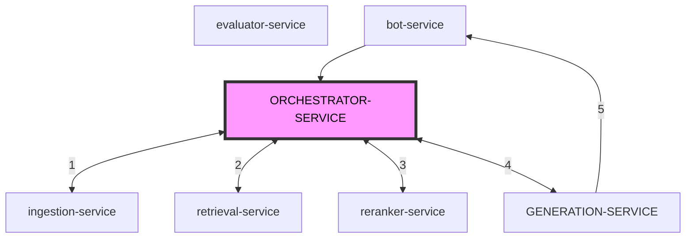

# ORCHESTRATOR-SERVICE 
- Сервис для управления rag pipeline

```mermaid
graph TD
    K[evaluator-service]
    
    
    F[bot-service] --> c[ORCHESTRATOR-SERVICE]  
    c <--1--> B[ingestion-service] 
    c <--2--> G[retrieval-service]
    c <--3--> E[reranker-service]
    c <--4--> I[GENERATION-SERVICE]
    I --5--> F
    
    
    style c fill:#f9f,stroke:#333,stroke-width:4px,color:#000
```
